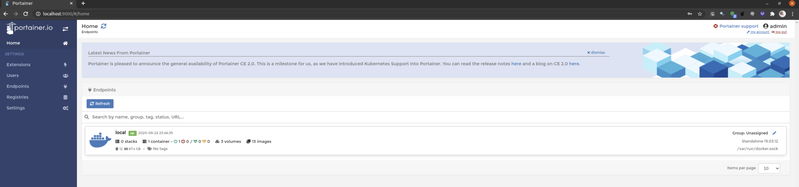

```{r setup, include=FALSE}
knitr::opts_chunk$set(echo = TRUE)
```

What is Portainer

Portainer is a lightweight management user interface that allows you to easily manage your Docker environments through a web interface.

Portainer provides multiple options to interface with images and containers. 
Managing images and containers may become easier with a good user interface for Docker.

This article briefly describes how to install Portainer on you Ubuntu system assuming that your docker engine is already up and running

A more extensive range of information about Portainer can be found at https://www.portainer.io/.

You can accomplish Portainer installation by downloading Portainer image from the DockerHub using the docker pull command

```{bash ,eval = F}
sudo docker pull portainer/portainer
```

Once the image is downloaded you can start Portainer with

```{bash ,eval = F}
sudo docker run -p 9000:9000 -v /var/run/docker.sock:/var/run/docker.sock --name portainer portainer/portainer
```

Assuming everything worked correctly, when pointing at: ip-addess:9000, after setting up password for admin user, you should see something like:

<BR>
```{r, echo = F}

```
<BR>

In case of trouble, just use the old restart trick

```{bash, eval = F}
sudo docker container restart portainer
```
